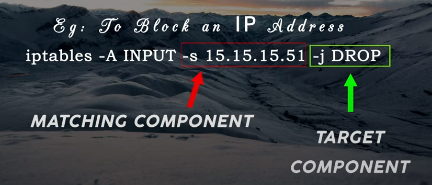

## Understanding the concept of IPtables

### **Netfilter and Iptables**
- **Netfilter** - The firewall solution for Linux. Software firewall and a packet filtering framework inside the kernel
- **Iptables** - Netfilter is controlled by the iptables command. It belongs to the userspace

Iptables is defined by three terms:
- **Tables**
- **Chains**
- **Rules**

Every packet is inspected by firewall rules. Firewall rules determine what traffic your firewall allows and what is blocked.
- The iptables firewall uses **tables** to organize its **rules**
- Within each iptables **table**, **rules** are further organized within separate **CHAINS**
- **Rules** are placed within a specific **chain** of a specific **table**
- Within a **chain**, a packet starts at the top of the chain and is matched rule by rule.
    
- When a match is found the target is executed
- A target is the action that is triggered when a packet meets the matching rule.
- If the target is terminating no other rule will evaluate the packet

### **Tables**
Iptables consists of five tables:
1. **filter** table
  - Main table
  - Default table
  - Role: Filtering packets
  - Provides majority of function
2. **nat** table
  - Provides Network Address Translation tools
  - Role: Routing Packets
3. **mangle** Table
  - Modify IP Headers
4. **raw** table
  - Connection tracking
5. **security** table
  - SELinux - Security-Enhanced Linux is a Linux kernel security module that provides a mechanism for supporting access control security policies, including mandatory access controls.
  - Tagging

> ``sudo iptables -t [table-name] -L`` - To list the chains for a specific table
>> Example: `` sudo iptables -t nat -L`` 
>> Note: The filter table is the default table and it is always shown if you do not specify another table

### **Chains**  
1. **PREROUTING** - used for DNAT / Port Forwarding
2. **INPUT** - used for filtering incoming packets. Our host is the packet destination.
3. **FORWARD** - used to filtering routed packets. Our host is the router.
4. **OUTPUT** - used to filtering outgoing packets. Our host is the source of the packet.
5. **POSTROUTING** - used for SNAT (MASQUERADE)

**Default Policies for the Chains**
They apply at the end of each chain and can be either ACCEPT or DROP. The define what happens to the packets if no rules are matched at the end of the chain. The chain is matched in a descending order.

Each chain is called in a different order for different tables. For the Filter Table the chains are: INPUT, FORWARD, OUTPUT

**General Chain Packet Traversal Order:**
- Incoming packets destined for the local system:
  - PREROUTING -> INPUT
- Incoming packets destined to another host:
  - PREROUTING -> FORWARD -> POSTROUTING
- Locally generated packets:
  - OUTPUT -> POSTROUTING

### **Rules**
Rule are user defined commands to manipulate network traffic. Each rule has two components. A matching component and a target component.
  

- Matching Components
  - Protocol
  - IP Address
  - Port Address
  - Interface
  - Header
- Target Component
  - Terminating Targets
    - Accept
    - Drop
    - Queue
    - Reject
    - Return
    - User-Defined
  - Non-Terminating Targets

### Options (commands)

These options specify the desired action to perform:
- ``-A`` - Append the rule to the end of the selected chain
> ``iptables -A INPUT -p tcp --dport 80 -j DROP``
- ``-I`` - Insert one or more rules in the selected chain on specific position. By default it is on top (position 1)
> ``iptables -I INPUT 3 -p tcp --dport 80 -j DROP``
- ``-L`` - List all rules in the selected chain. If not chain is selected, all chains are listed
> ``iptables -vnL --line-numbers``
- ``-F`` - Flush the selected chain (all the chains in the table if none is given)
> ``iptables -t nat -F INPUT``
- ``-Z`` - Zero the packet and byte counters in all chains, or only the given chain
> ``iptables -Z -t filter INPUT``
- ``-N`` - Create a new user-defined chain by the given name
> ``iptables -N MYCHAIN``
- ``-X`` - Delete the user-defined chain specified
> ``iptables -X MYCHAIN``
- ``-P`` - Set the policy for the built-in chain (INPUT, OUTPUT or FORWARD chains)
> ``iptables -P INPUT DROP``
- ``-D`` - Delete one or more rules from the selected chain. Uses the line number
> ``iptables -D INPUT 2``
- ``-R`` - Replace one or more rules from the selected chain

### Default Policy for CHAINS
Policy specifies what happens to packets that are not matched against any rule
- By default Policy is set to accept all traffic
- Policy can be changed only for the INPUT, OUTPUT and FORWARD chains
- Policy can be changed using -P option
  

### Loading Firewall at boot (iptables-save & iptables-restore)

Rules created with iptables are stored only in memory. If the system is restarted before saving the iptables rule set, all rules are lost
- ``iptables-save`` dumps rules to ``stdout`` or to a file
- ``iptables-restore`` loads rules from a file into memory

How to save iptables rules after restart:
1. Install iptables-persistent
2. Save iptables rules
> ``iptables-save > /etc/iptables/rules.v4``
3. Remove persistent iptables rules
> Edit ``/etc/iptables/rules.v4``
4. Restore iptables rules from file:
> ``iptables-restore < /etc/iptables/rules.v4``
