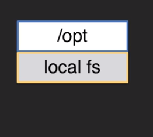
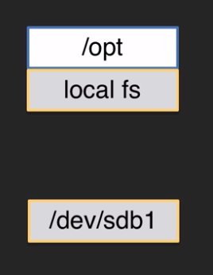
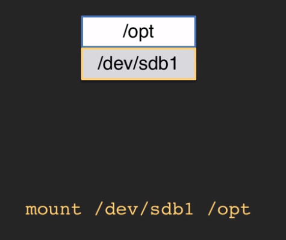
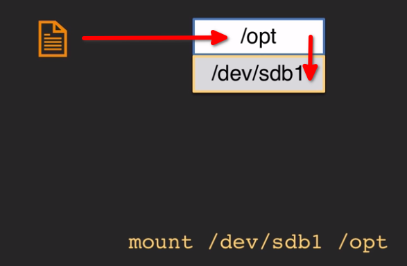
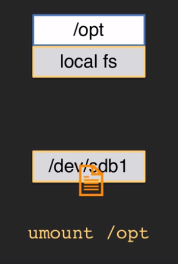
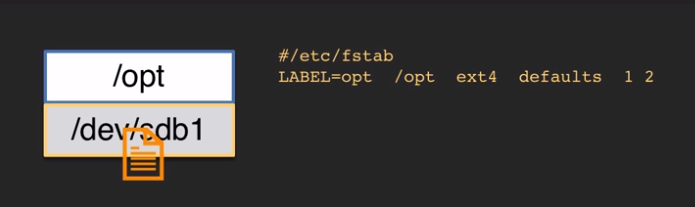

## Understanding Mount Points

On every typical Linux installation you have the ``/opt`` directory which is located on the local filesystem: 
  

Let's say you need more space on your ``/opt`` directory. You set up a disk with a new partition and a new filesystem:
  

We can then mount it to our ``/opt`` directory using the ``mount`` command.
  

It is like each **directory** is a **docking port** and each individual **FS** is a **ship** that gets docked to that particular **docking port**

When you save a file in a directory, that file is saved to the filesystem as if loading cargo into a ship
  

If you reboot the machine or unmout that FS using the ``umount`` command the file you have saved gets unmounted with the FS and ``/opt`` reverts to the local FS.
  

If you need this data to be consistant, you will need to entry of this FS in the ``/etc/fstab`` file:
  

## Mount and Unmount FS

### Mount Commands

> ``/etc/mtab`` - The list of all mountpoints

> ``mount`` - Command used to mount a FS to a mount point(directory)

> ``unmount`` - Command used to unmount a FS. Can specify either the device, label or mount point(directory)

> ``/etc/fstab`` - FS table file. Permanent mount configs are set here
