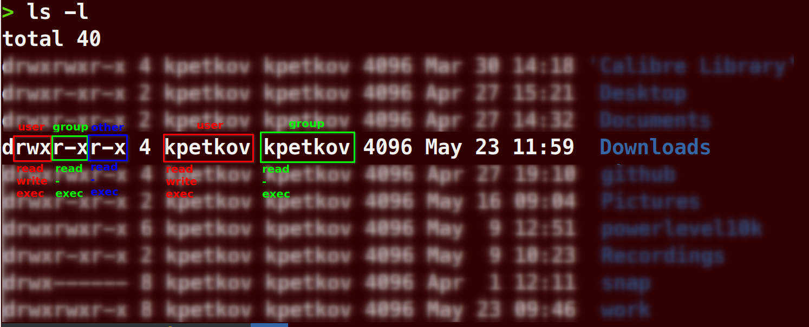
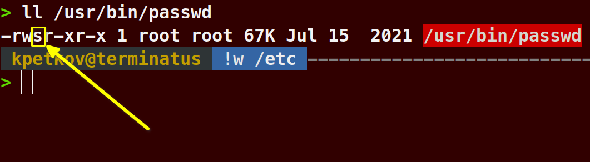
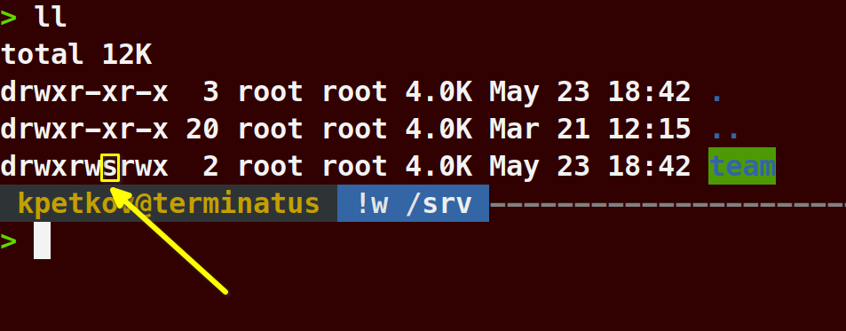
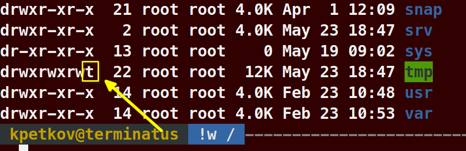
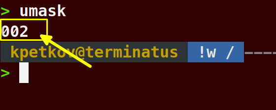

## Basic file and folder permissions

### Permissions

Permissions are broken down into three categories:
- user
- group
- other/world

Symbolic Permissions:
- r = Read Permissions
- w = Write Permissions
- x = Execute Permissions
> Note: 
>> - **x** on a directory means that you have the permission to execute the action of opening that directory. You can list the directory content, but without the **x** permission you cannot ``cd`` to that directory 
>> - **-** (dash) means **no permission**

Octal Permissions:
- 4 = Read Permissions
- 2 = Write Permissions
- 1 = Execute Permissions
- 0 = No Permissions

  

  

### Modify Basic Access Modes

> ``chown`` - Change ownership of a file or directoru

> ``chmod`` - Change the mode of a file or directory i.e. change the permissions

> ``chgrp`` - Change the group ownership of a file or folder

### Advanced Permissions

1. SUID

> ``SUID`` - The "set user id" bit. File with an ``s`` in the place of the ``x`` permission within the user's column have this set. Nothe that this will not work on Bash scripts anymore. Also manu file systems can be mounted with the "nosuid" option.
   **Note:** This basically means that it allows anybody that runs this particular program to run it as if they are the owner of the application.

Typically when changing permissions on a file we use 3 numbers to denote the different permissions for user, group and other. However, there are actually 4 numbers and the first one (used to set the SUID or SGID) is always set as ``0``. This means that ``chmod 777 [file-name]`` is actually ``chmod 0777 [file-name]``. So if we want to set the SUID for the file we will have to use ``chmod 4777 [file-name]`` to get the ``s`` permission there.

2. SGID

> ``SGID`` - The "set group id" bit. Fiels and fodlers with the ``s`` in the place of the ``x`` permission within the group's column have this set. This assigns group ownership to files. Useful for shared group directories.
  
**Note**: This basically means that members of that group can edit each other's files within the directory set with this special permission. Esentially making a "shared" folder.

To change the permission so you can set a shared folder with this special permission you must use ``chmod -R 2777 [folder-name]``

3. StickyBit

> ``StickyBit`` - This permission has ``t`` in place of the ``x`` in the other's column. This permission only allow the creator of the file to remove the file
  
**Note:** This basicalyl prevents the removal of a file from anyone else besides the owner.

To change the permissions on a file use ``chmod 1777 [test-file]``

## Default File and Folder Permissions

> ``umask`` - Shows the current umask settings. Can also be used to set a new umask value for the current shell session.
  
**Note:** This basically shows what gets taken away from the default permissions (below) with the current umask setting. You basically subtract this number from the defaults to get your current value for permissions of newly created files. So this means that a new folder will be created with ``775`` value.

1. Default Permissions

``777`` - default for directories
``666`` - default for files

2. umask value

Subtract the umask value from the default permission to get the currently configured permission value.

3. Permanent Configuration

``/etc/bashrc`` = umask set for the whole system

``/home/[user]/.bashrc`` = umask set for the individual user
