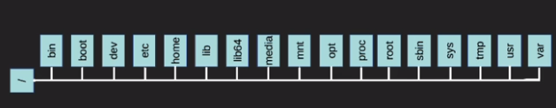

## File System Hierarchy Standard

### The role of a Linux Filesystem

Computer data is stored on a storage device with a certain manner:
- The data is organized and easily located
- The data can be saved in a peristent manner
- Data integrity is preserved
- The data can be quickly retrieved for a user in a later point in time

### Standard Layout of the Linux File System

FS Hierarchy Standard (FHS)
- https://www.pathname.com/fhs/
- Directory Structure
  - invereted tree with a single root
  - Case sensitive
  - Paths are delimited by a ``/``
  - Any folder or file whose name is preceeded by a ``.`` are hidden from normal view
  - A single ``.`` in a directory refers to the current directory
  - A double ``..`` refers to the parent directory of any particular directory, one direcotry up in the file hierarchy

  

``/`` - The root of our filesystem. 
``bin`` - Executable programs that the users on the system can run. This is where the ``ls``, ``cd``, ``pwd``, ``echo`` and other commands would reside  
``boot`` - Contains the files needed to get the computer booted up. The Linux Kernel itself also resides in this directory. 
``dev`` - Where all devices are referenced from. This includes HDDs, keyboards, soundcards, and anything else that connects to the computer 
``etc`` - Contains configuration files for most of the system services and system info  
``home`` - Contains all the user files 
``lib`` & ``lib64`` - For library files that conain code that is shared with many applications on our system 
``media`` - It is where CD Drives are mounted along with USB Drives and others.  
``mnt`` - It is where you can access other HDDs mounted on your system  
``opt`` - Optional location for applications not stored in the ``/bin`` directory 
``proc`` - Info about the running Linux system  
``root`` - The home directory for the ``root`` user.  
``sbin`` - Where system admin tools and programs are located  
``srv`` - Typically used for server applications  
``sys`` - Contains info of the hardware on the system  
``tmp`` - Usualyl used by applications to store temporary data. 
``usr`` - This is the user directory. It contains its own set of directory tree that  mirrors that of the root directory. You can find more applications here along with system documentation and other configuration files  
``var`` - Contains files that tend to vary in size such as log files  

## Finding Commands on a Linux System

### Finding Commands

> ``locate`` - Command that searches a local database of files and folders looking for items that match the searched criteria

> ``updatedb`` - Updates the database that the ``locate`` command uses

> ``whereis`` - This command locates binary, source and/or manual pages for a command
