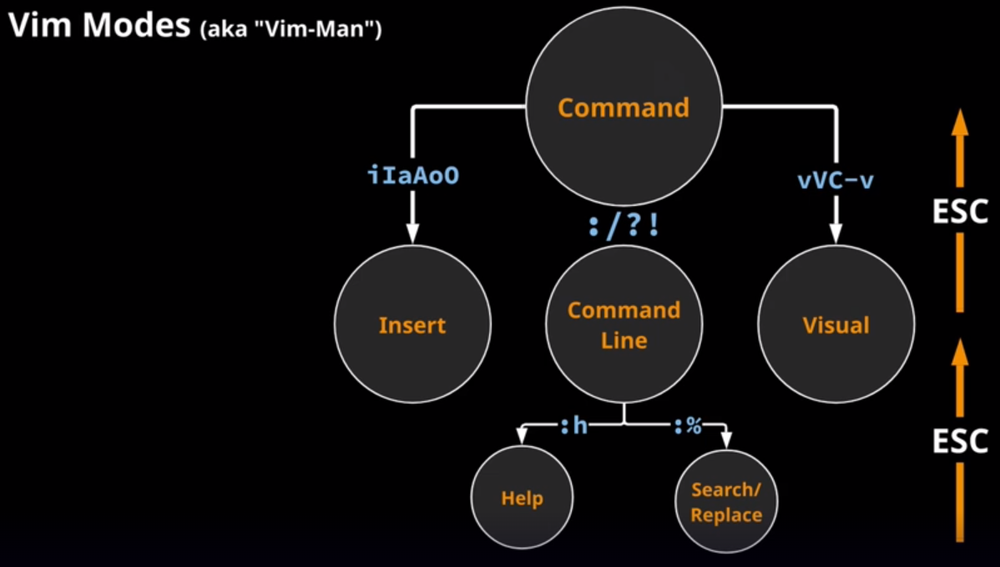

## Vim Modes

  

### Vim Modes of Operation
- 6 basic modes:
  - 6 Alternate modes
  - Some very specialized

- Main modes:
  - Command
  - Insert
  - Command Line

### Command Mode

- Otherwise known as Normal Mode
  - Default mode whenever you enter Vim
  - Provides access to other modes
  - Hit [ESC Key] in another mode to retreat back to Command Mode
  - Keystrokes produce Action, not typed characters

### Insert Mode

- Reached from Command Mode
  - Press [ESC key] to return to Command Mode
  - Characters typed appear in plain text
  - May have to hit [ESC key] twice

### Command Line Mode

- Also known as LastLine Mode
  - Most operations beguin with ``:``
  - They appear to exectue on the last line of the interface

- Reached from Command Mode

- For overall operations
  - Svaing and Exiting
  - Loading files
  - Search/replace

- Entering Help Mode
  - not really an offical mode
  - extensive help:
  - ``:help vb``
  - ``:h inserting``
  - ``:h -o``

### Visual Mode

- Selecting characters/lines/columns
- Commands affect selection
