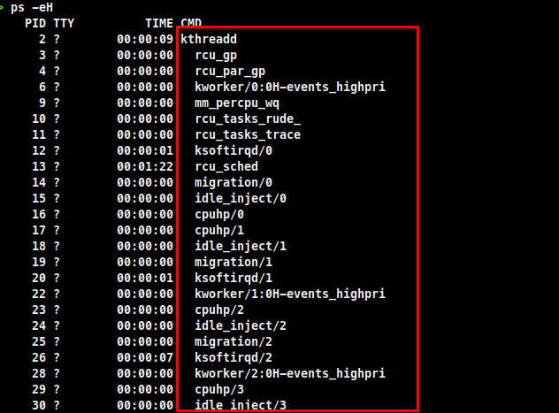
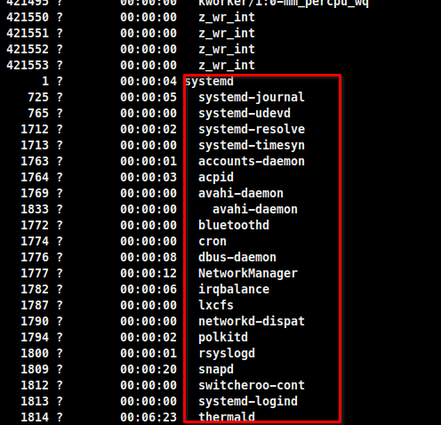

## Basics of a Process
A process a set of instructions loaded into your memory. These instructions come from a program that is running. There are several properties and components that come with a process such as a memory context, a priority (which dictates how much time the CPU allots to the process), and environment. After the Linux kernel has booted the system, it hands the control of the system to a process named **PID 1**. **PID** stands for **Process ID**.

The **PID 1** process is **systemd** and it is the master parent process. All other processes are nested udner it.
> ``ps -eH`` - This will list all your current process.
>> The process nested under **PID 2** are called **Kernel Space** 
>> Example: 
>>  
>> The process nested under **PID 1** are called **User Space** 
>> Example: 
>>  

## Reviewing the state of a process

> ``ps`` - Lists the process status of each running process on the system in the current shell
>> ``ps -u [username]`` - Lists the process status of each running process on the system for the current user 
>> ``ps -e`` - Lists all the processes for all users 
>> ``ps -e --forest`` - Lists the processes in a tree view.
>> ``ps -efH`` - Get all arguments the process is using.

> ``top`` - Interactive, near real-time monitoring of processes running on a system.
>> To kill a process while in top press the ``k`` key and input the **PID** of the process.

> ``man proc`` - Manual page for the **/proc** pseudo system dir.  
The **/proc** contains the info about the processes.

> ``man signal`` - Manual pages for the various signal states of processes.

## Monitoring processes

> ``uptime`` - View how long the system has been up, how many users are logged in, and the CPU load average

> ``free`` - View used and available memory and swap space.

> ``pgrep`` - Find process information based on process name

> ``kill`` - Send a signal (usually SIGETRM) to a process based on a PID

> ``pkill`` - Send a signal (usually SIGETRM) to a process based on a name

## Keep a Process running
