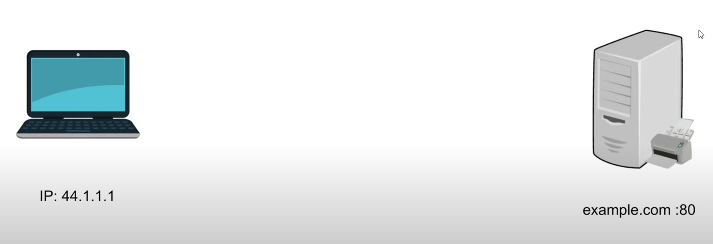
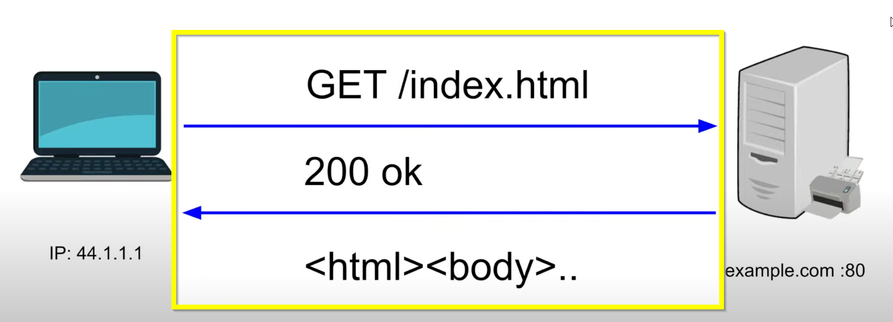

## What is a Web Server?

Course: 
[What are web servers and how do they work (with examples apache and nodejs)](https://www.youtube.com/watch?v=JhpUch6lWMw)

1. Software that serves web content
- What is web content
  - HTML pages
  - Images
  - PDF
  - Anything that can load and transfer as a web content

2. Uses the HTTP protocol
- [What is HTTP](https://www.youtube.com/watch?v=0OrmKCB0UrQ)
  - Hyper Text Transfer Protocol

3. Static and Dynamic content
- Static Content
  - HTML pages
  - CSS
  - JavaScript Files
- Dynamic Content
  - When you query the DB and get different content based on the user query
  - Generates different content based on context: user, location, etc.

4. Used to host web pages, blogs and build APIs

## How Web Servers work?

1. Web-servers will process requests through a specific port. Usually the default port is:
- 80 for HTTP
- 443 for HTTPS
  

2. When you have a web-server running and listening to this port there is a TCP connection (or socket) ready. When you make a request like "Get me the index page for this website", the webserver processes that request and returns a response(status) code and the content
  

## Examples
OTS Web Servers
- httpd (Apache)
- ISS
- lighttpd
- tomcat
- http-server

Write your own
- nodejs
- python tornado 
